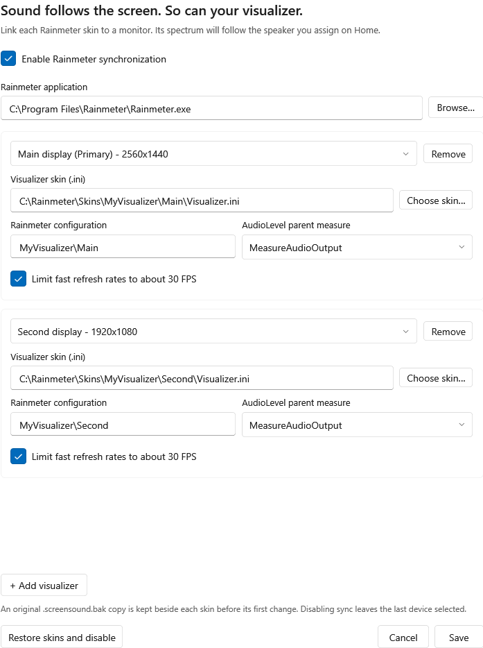

# ScreenSound · Rainmeter Edition

让声音跟着窗口走，让频谱跟着音响走。

[English](docs/README.en.md) · [下载测试版](https://github.com/Harry3342138/ScreenSound-Rainmeter/releases) · [原项目](https://github.com/twibster/ScreenSound) · [最小化修复 PR](https://github.com/twibster/ScreenSound/pull/19)

这是基于 **Omar Omran / twibster 的 ScreenSound** 制作的社区分支，保留原项目 MIT 许可证和版权声明。当前版本为 `2.1.0-rainmeter.1` 测试版。

## 功能

- 给每个显示屏分配音响，播放器拖到哪个屏幕，就使用对应音响。
- 播放器最小化或隐藏到托盘后，保留最后所在屏幕的分配；恢复并拖动仍正常切换。
- 每个雨滴频谱可绑定一个显示屏。修改 ScreenSound 的音响分配时，对应频谱自动切换监听设备。
- 分配变化时才修改、刷新受影响的皮肤，没有为联动增加常驻脚本、文件监视器或定时轮询。
- 可将刷新过快的皮肤限制到约 30 FPS；原本更慢的皮肤保持原间隔。
- 修改皮肤前保留原始备份，界面提供恢复功能。

同一音响分给两个屏幕时，两条频谱都会反映该音响的声音。每条频谱监听的是音频设备上的全部声音。

## 安装

适用于 **Windows 11 x64**。雨滴联动需要自行安装 [Rainmeter](https://www.rainmeter.net/) 和使用 `AudioLevel` 插件的频谱皮肤。本项目不打包第三方皮肤。

1. 在 [Releases](https://github.com/Harry3342138/ScreenSound-Rainmeter/releases) 下载 ZIP。
   - `win-x64-self-contained.zip`：推荐，包含 .NET 运行时。
   - `win-x64-framework-dependent.zip`：体积更小，需要 [.NET 8 Desktop Runtime x64](https://dotnet.microsoft.com/download/dotnet/8.0)。
2. 解压整个 ZIP。如果原版 ScreenSound 正在运行，请先从托盘菜单退出。
3. 双击 `Install.cmd`，安装到当前用户目录，无需管理员权限。也可以直接运行解压目录内的 `ScreenSound.exe`。
4. 从开始菜单打开 **ScreenSound Rainmeter Edition**。若设置了启动时最小化，从托盘双击打开窗口。

已有音响分配会沿用。原版和本分支共享音响设置与单实例锁，每次运行其中一个版本。已经启用的开机启动会在安装时指向本分支；以后可在 Settings 中切换。

可选 PowerShell 参数：`Install.ps1 -StartWithWindows -DesktopShortcut`。安装包当前没有代码签名，发布页提供 SHA-256 校验文件。

## 设置频谱联动

1. 在 **Home** 为每个屏幕选择音响。
2. 打开 **Settings → Configure visualizers…**，确认 `Rainmeter.exe` 路径。
3. 点击 **Add visualizer**，选择屏幕，再点击 **Choose skin…** 选择该屏频谱使用的 `.ini` 文件。
4. 配置名称会根据 Rainmeter 的皮肤目录自动填写；如果使用自定义/便携目录，填入 Manage Rainmeter 中显示的皮肤文件夹路径，例如 `MyVisualizer\Bars`。
5. 选择 AudioLevel 父 measure。通常只有一个可选项；子 measure 不会列出。
6. 按需勾选约 30 FPS 限制，启用 **Enable Rainmeter synchronization**，点击 **Save**。

一个皮肤文件对应一块显示屏。双屏同时显示两条独立频谱时，请先在 Rainmeter 中准备两份不同的皮肤配置。皮肤应已在 Rainmeter 中加载，联动只刷新已加载配置，不自动加载或移动皮肤。



之后只需在 Home 更换音响，不必手动复制音频设备 ID。未分配或设备断开时，对应采集会暂停；分配恢复后重新启用。关闭联动会保留最后一次写入的设备，不持续改动皮肤。

## 备份、回退与卸载

- 第一次修改前，在皮肤 `.ini` 旁生成 `.screensound.bak`，后续切换不覆盖这份原始备份。
- **Restore skins and disable** 会将已经保存的绑定恢复到最初备份，并关闭联动。它恢复整个皮肤文件，之后的手动修改也会被替换，界面会提示确认。
- 卸载前先按需恢复皮肤，然后从托盘退出程序。在 `%LOCALAPPDATA%\Programs\ScreenSound-Rainmeter` 运行 `Uninstall.cmd`。
- 卸载只删除这个分支的程序和快捷方式，保留音响设置、频谱文件与备份；若安装前存在开机启动入口，会恢复原入口。
- 便携运行时无需安装/卸载。退出后可移走解压目录；若启用了开机启动，请先在 Settings 中关闭。

## 配置和已知限制

- 音响设置：`%APPDATA%\ScreenSound\settings.json`。
- 频谱绑定：`%APPDATA%\ScreenSound\RainmeterBindings.json`。配置默认关闭，首次使用通过界面开启。[示例配置](docs/RainmeterBindings.example.json) 使用占位路径，不含真实设备 ID。
- 当前支持在所选 `.ini` 中直接定义的父 `Plugin=AudioLevel` measure。放在 `@Include` 文件中的父 measure、其他音频插件暂不支持。
- 如果 ScreenSound 启动前播放器已经完全隐藏到托盘，先恢复一次窗口，让它记录屏幕位置。
- 更换显示器或改变显示设备名称后，在设置中重新选择该皮肤对应的显示屏。
- 插拔屏幕后可点击 Home 的刷新按钮重建屏幕列表；音频设备插拔会自动刷新。
- 当前主要在一台双屏 Windows 电脑上验证，Windows 10、ARM64 和不同第三方皮肤组合尚未全面验证。
- 联动没有额外轮询，但 ScreenSound 和 Rainmeter 本身仍会使用 CPU/内存。资源占用随皮肤、音频和窗口操作变化。

## 构建与测试

安装 .NET 8 SDK，在仓库根目录执行：

```powershell
dotnet build ScreenSound.sln -c Release
dotnet run --project tests/MonitorRegression/MonitorRegression.csproj -c Release
dotnet run --project tests/RainmeterRegression/RainmeterRegression.csproj -c Release
```

16 项窗口状态回归、22 项频谱联动检查，以及本机双屏环境的 12 项真实 Win32 检查已通过。原版在本次窗口最小化/隐藏回归场景中可复现失败。[测试说明](tests/README.md)

```powershell
pwsh -File scripts/Package.ps1 -Version 2.1.0-rainmeter.1
```

该脚本生成两种下载包和校验文件。GitHub Actions 使用同一构建步骤；原项目的自动发布和 Winget 提交流程已从这个分支移除。

## 来源与许可

原项目：[twibster/ScreenSound](https://github.com/twibster/ScreenSound)，Copyright © 2026 Omar Omran，使用 [MIT License](LICENSE)。本分支由 [Harry3342138](https://github.com/Harry3342138) 发布，保留原作者署名，修改同样遵循 MIT。

[第三方依赖与许可](THIRD_PARTY_NOTICES.md)。软件内原作者的捐赠入口仍指向原作者。本分支与 Rainmeter 项目没有官方隶属关系。
